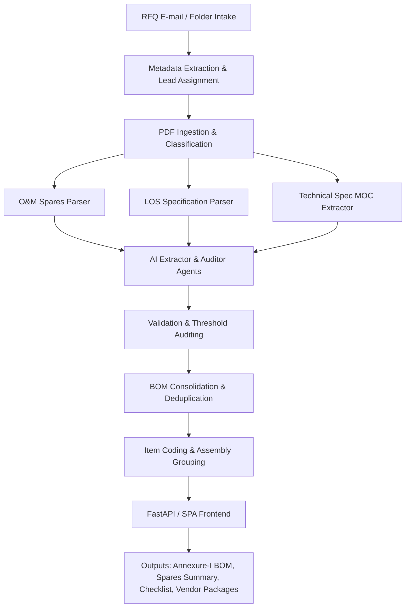

# Smart RMC AI — Unified Cenlub RFQ to Annexure-I BOM CSV Pipeline

Smart RMC AI is a production-grade, AI-driven automation pipeline designed for **Cenlub Systems**. It automates the intake and processing of customer Request for Quotation (RFQ) packages. The system converts raw, unstructured inputs—such as email threads, PDF datasheets, Lube Oil System (LOS) specifications, and drawings—into structured, validated Bill of Materials (BOM) CSVs and Excel sheets formatted according to Cenlub's internal **Annexure-I** standards.

---

## 📖 Table of Contents
1. [Project Overview](#-project-overview)
2. [Key Features](#-key-features)
3. [System Architecture](#-system-architecture)
4. [File Structure](#-file-structure)
5. [Prerequisites & Installation](#-prerequisites--installation)
6. [Usage Instructions](#-usage-instructions)
   - [Running the Command Line Pipeline](#1-running-the-command-line-pipeline)
   - [Starting the FastAPI Web App Server](#2-starting-the-fastapi-web-app-server)
   - [Verification](#3-verification)
7. [Dependencies & Libraries](#-dependencies--libraries)

---

## 🌟 Project Overview

At Cenlub Systems, processing an incoming RFQ traditionally involves manually reviewing email correspondence, parsing extensive technical PDFs (including O&M Spares lists, technical specifications, and P&ID drawings), filling out verification checklists, mapping parts to internal item codes, and generating quotes. 

This project automates the entire lifecycle through a structured pipeline:
* **Email & Document Intake**: Extracts metadata, customer reference codes, and validates incoming files.
* **Intelligent PDF Parsing**: Extracts tabular spares lists and matches items against project specifications.
* **LLM-Based Extraction & Validation**: Uses Gemini Pro to extract technical parameters and audit them via a Critic/Auditor Agent.
* **BOM Consolidation**: Consolidates items, detects duplicates using custom hashing, and maps parts to internal category prefixes (`L`/`M`/`I`/`E`/`P`).
* **Interactive Dashboard**: A React-like Single Page Application (SPA) served via FastAPI to upload, edit, chat (RAG-based document Q&A), and export the generated files.

---

## ✨ Key Features

* **Phase-Based Pipeline**: Execution flows from Phase 0 (Setup & Schema) up to Phase 6 (Vendor pricing ingestion and priced BOM exports).
* **Robust PDF Ingestion**: Combines `pdfplumber` and `PyMuPDF` with graceful fallbacks (e.g., handling missing PaddleOCR libraries).
* **Multi-Agent Quality Check**: Employs an Extractor Agent and a Critic/Auditor Agent to double-check and validate extracted RMC metrics against user-defined thresholds (e.g. pressure, temperature, flow rates).
* **Quadratic Hash Table Deduplication**: Implements custom data structures (`QuadraticHashTable`) for in-memory deduplication during BOM consolidation.
* **Automatic Item Coding**: Maps components to Cenlub standard item codes:
  * `L` — Lube Oil / Pump items
  * `M` — Mechanical items
  * `I` — Instrumentation items
  * `E` — Electrical components
  * `P` — Piping elements
* **RAG-Powered Q&A**: FAISS-based vector database and sentence transformers allow users to chat with uploaded RFQ documents on the fly.
* **Dual-Format Output**: Generates Annexure-I BOM files, Customer Spares Summaries, and Checklists in both CSV and formatted Excel (.xlsx) sheets.
* **Vendor Loop Automation**: Automates the creation of vendor inquiry sheets and imports returned pricing sheets to export a finalized, priced BOM.

---

## 🏗️ System Architecture



---

## 📁 File Structure

```text
├── app/                        # FastAPI Web Application
│   ├── extraction/             # Document classification and text extraction
│   ├── generators/             # CSV and Excel output writers
│   ├── ingestion/              # PDF parsing and OCR handlers
│   ├── llm/                    # Gemini API clients and agent prompts
│   ├── rag/                    # FAISS retrieval and embeddings setup
│   ├── schema/                 # Pydantic models and field validators
│   ├── static/                 # SPA UI frontend assets (HTML, CSS)
│   └── main.py                 # FastAPI Entry Point (Web Server)
│
├── src/                        # Secondary Core Implementation Modules
│   ├── api/                    # Alternative Web Server implementation
│   ├── core/                   # Main data schemas (BOMNode, RMCData) & Hash Tables
│   ├── extraction/             # Core BOM classification and text extraction rules
│   ├── ingestion/              # Core PDF loaders
│   ├── llm/                    # Core Gemini Client and Agent functions
│   ├── output/                 # Core CSV, Excel, and vendor package writers
│   └── rag/                    # Core vector search index
│
├── data/                       # Local File Storage
│   ├── raw/                    # Raw uploaded RFQ documents and email files
│   └── processed/              # Generated Annexure-I, Spares summaries, and checklists
│
├── tests/                      # Pipeline test suites
├── pipeline.py                 # Core CLI entry point for the automation pipeline
├── run_server.py               # Utility script to run the secondary API server
└── verify_fixes.py             # Script to verify module imports and code health
```

---

## 🛠️ Prerequisites & Installation

### 1. Requirements
Ensure you have **Python 3.8+** installed.

### 2. Install Dependencies
Run the following command to install the required libraries:
```bash
pip install -r requirements.txt
```

### 3. Setup Environment Variables
Create a `.env` file in the root directory:
```env
GEMINI_API_KEY=your_gemini_api_key_here
# Optional if using alternative LLMs
OPENAI_API_KEY=your_openai_api_key_here
```

---

## 🚀 Usage Instructions

### 1. Running the Command Line Pipeline
To run a local run of the RFQ pipeline:
```bash
# Run with default directories (data/raw -> data/processed)
python pipeline.py

# Specify customized folders and api keys
python pipeline.py --input data/raw --output-dir data/processed --gemini-key YOUR_API_KEY
```

### 2. Starting the FastAPI Web App Server
To launch the interactive GUI dashboard, choose one of the following methods:

**Primary Server:**
```bash
python -m uvicorn app.main:app --reload
```

**Alternative Server:**
```bash
python run_server.py
```
Open your browser and navigate to `http://127.0.0.1:8000` to view the user interface.

### 3. Verification
You can quickly run the validation utility to ensure all 22 python modules load correctly:
```bash
python verify_fixes.py
```

---

## 📦 Dependencies & Libraries

* **FASTAPI & Uvicorn**: High-performance asynchronous web framework and server.
* **PyMuPDF & pdfplumber**: Robust extraction of plain-text and structured tables from complex engineering documents.
* **google-genai & instructor**: Structured LLM extractions.
* **faiss-cpu & sentence-transformers**: In-memory semantic search indexing for RAG chat.
* **openpyxl & pandas**: High-quality Excel spreadsheets generation with formatted headers.
* **psycopg2-binary**: PostgreSQL adapter.
* **rapidfuzz**: Advanced fuzzy string matching for item deduplication.
